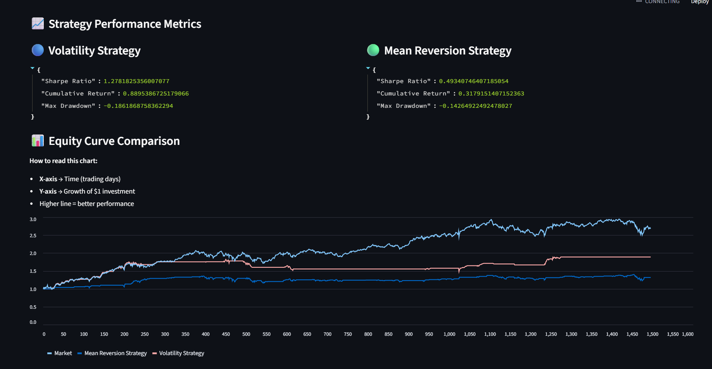

# 📊 Quant Research Platform

A modular **quantitative research and backtesting system** built using Python.
This platform integrates **data pipelines, trading strategies, backtesting engine, API services, and interactive dashboards** to simulate and evaluate trading ideas.

---

## 🚀 Overview

This project demonstrates an end-to-end workflow used in quantitative trading:

* 📥 Data ingestion & preprocessing
* ⚙️ Feature engineering
* 📈 Strategy development (Volatility & Mean Reversion)
* 🧪 Backtesting engine with performance metrics
* 🌐 FastAPI backend for execution
* 📊 Streamlit dashboard for visualization
* ✅ Automated testing using pytest

---

## 🏗️ Project Architecture

```
quant-research-platform/
│
├── app/
│   ├── api/            # FastAPI routes
│   ├── core/           # Config & settings
│   ├── data/           # Ingestion, preprocessing, storage
│   ├── features/       # Feature engineering
│   ├── strategies/     # Trading strategies
│   ├── backtest/       # Backtesting engine & metrics
│   ├── models/         # ML models (optional/extendable)
│   └── main.py         # FastAPI entry point
│
├── dashboard/          # Streamlit UI
├── tests/              # Unit & integration tests
├── data_store/         # Local data storage (ignored in Git)
├── requirements.txt
├── pytest.ini
└── Dockerfile
```

---

## 📈 Strategies Implemented

### 🔹 Volatility Strategy

* Trades when volatility is high and trend is positive
* Uses rolling standard deviation and moving averages

### 🔹 Mean Reversion Strategy

* Buys when price deviates below its moving average
* Assumes price will revert to the mean

---

## 📊 Performance Metrics

* Sharpe Ratio
* Cumulative Return
* Maximum Drawdown

---

## ▶️ How to Run

### 1️⃣ Clone Repository

```
git clone https://github.com/summi-rahman/quant-research-platform.git
cd quant-research-platform
```

---

### 2️⃣ Create Virtual Environment

```
python -m venv venv
venv\Scripts\activate
```

---

### 3️⃣ Install Dependencies

```
pip install -r requirements.txt
```

---

### 4️⃣ Run Backend (FastAPI)

```
uvicorn app.main:app --reload
```

API endpoint:

```
http://127.0.0.1:8000/run-strategy
```

---

### 5️⃣ Run Dashboard (Streamlit)

```
streamlit run dashboard/app.py
```

Dashboard:

```
http://localhost:8501
```

---


## 📊 Dashboard Preview




## 🧪 Running Tests

```
pytest
```

---

## 🐳 Docker (Optional)

```
docker build -t quant-platform .
docker run -p 8000:8000 -p 8501:8501 quant-platform
```

---

## 🧠 Key Highlights

* Modular and scalable architecture
* End-to-end research pipeline
* Strategy comparison framework
* Clean API + UI integration
* Reproducible and testable system

---

## 📌 Future Improvements

* Parameter optimization (grid search / Bayesian tuning)
* Portfolio-level backtesting
* Transaction cost modeling
* Live data streaming
* Advanced ML-based strategies

---

## 👤 Author

**Sumaiya Rahman**
GitHub: https://github.com/summi-rahman

